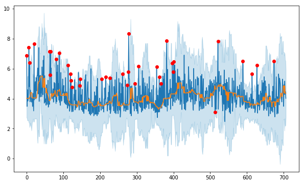

# My Anomaly Detection Notebook and Examples

## Build your own image
```
# build image
docker build -t anom-notebook .

# run the container
docker run --rm -itd -p 8000:8888 -e GRANT_SUDO="yes" --user root anom-notebook
```

Once the container is running, brows the address: `localhost:8000` and login, the note is under `anom` folder.

## Use existing note server
Copy following files into your node and refresh.

## Demo - Change window and threshold



1. Find MAD (Median Absolute Deviation) section
2. Find `df = anom_algorithms.run_with_mad(data, 3, 10)`
3. Second parameter `3` is threshold (deviation) and `10` is the window size
4. Run

## Demo - Use your own data

1. Find an interesting graph in Santaba
2. Maximum the graph and select the time range
3. Click download button on the upper right, then you got the raw data
4. Copy the data into your notebook
5. Change the code `data = get_data_csv()`
6. This method supports 2 parameters, first one is `file_path`, the second parameter is `column_name`. e.g. Your downloaded csv file is `demo.csv` and data is:

    | Time | - | prod16.dc4 | prod08.ld5 |
    |------|---|------------|------------|
    | 2018/12/10 09:28:00 | PST | 1.9917 | 6.1233 |

    I want to see the line on column `prod16.dc4`, The code could be changed to `data = get_data_csv('demo.csv', 'prod16.dc4')`